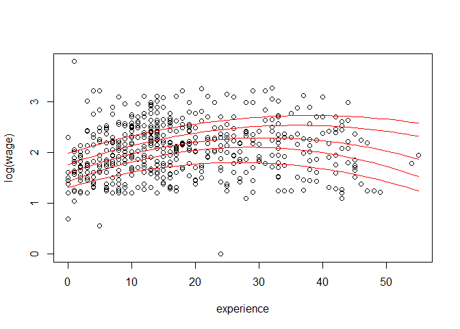

Regresion
================

Ejemplos de Regresion Lineal
----------------------------

En este docuemnto tenemos ejemplos hechos en clase de regresion lineal.

Para mostrar rápidamente la sintaxis básica de regresiones lineales en R usamos el ejemplo 2 de la introduccion de Kleiber:

``` r
# Creamos un objeto llamado reg.lineal con toda la data generada por el cálculo
reg.lineal <- lm(log(wage) ~ experience + I(experience^2) + education, data = cps)

# Los resultados en formato normal:
summary(reg.lineal)
```

    ## 
    ## Call:
    ## lm(formula = log(wage) ~ experience + I(experience^2) + education, 
    ##     data = cps)
    ## 
    ## Residuals:
    ##      Min       1Q   Median       3Q      Max 
    ## -2.12709 -0.31543  0.00671  0.31170  1.98418 
    ## 
    ## Coefficients:
    ##                   Estimate Std. Error t value Pr(>|t|)    
    ## (Intercept)      0.5203218  0.1236163   4.209 3.01e-05 ***
    ## experience       0.0349403  0.0056492   6.185 1.24e-09 ***
    ## I(experience^2) -0.0005362  0.0001245  -4.307 1.97e-05 ***
    ## education        0.0897561  0.0083205  10.787  < 2e-16 ***
    ## ---
    ## Signif. codes:  0 '***' 0.001 '**' 0.01 '*' 0.05 '.' 0.1 ' ' 1
    ## 
    ## Residual standard error: 0.4619 on 530 degrees of freedom
    ## Multiple R-squared:  0.2382, Adjusted R-squared:  0.2339 
    ## F-statistic: 55.23 on 3 and 530 DF,  p-value: < 2.2e-16

``` r
# Diferentes partes de los resultados utilizando el paquete "broom" incluido en tidyverse

# A nivel de variable (coeficientes, p-values, etc)
tidy(reg.lineal)
```

    ##              term      estimate    std.error statistic      p.value
    ## 1     (Intercept)  0.5203217710 0.1236162526  4.209170 3.010737e-05
    ## 2      experience  0.0349403392 0.0056492113  6.184994 1.242179e-09
    ## 3 I(experience^2) -0.0005362401 0.0001245024 -4.307068 1.971719e-05
    ## 4       education  0.0897560821 0.0083205199 10.787317 1.160240e-24

``` r
# A nivel de observación (genera estimaciones, residuales, etc.)
head(augment(reg.lineal))
```

    ##   .rownames log.wage. experience I.experience.2. education  .fitted
    ## 1         1  1.629241         21             441         8 1.735636
    ## 2      1100  1.599388         42            1764         9 1.849693
    ## 3         2  1.897620          1               1        12 1.631799
    ## 4         3  1.386294          4              16        12 1.728576
    ## 5         4  2.014903         17             289        12 2.036407
    ## 6         5  2.570320          9              81        13 1.958178
    ##      .se.fit      .resid        .hat    .sigma      .cooksd  .std.resid
    ## 1 0.05261865 -0.10639514 0.012975435 0.4623457 1.766412e-04 -0.23183504
    ## 2 0.05356309 -0.25030568 0.013445402 0.4622393 1.014041e-03 -0.54554606
    ## 3 0.04909659  0.26582101 0.011296534 0.4622230 9.566966e-04  0.57873206
    ## 4 0.03795644 -0.34228191 0.006751704 0.4621279 9.393949e-04 -0.74349201
    ## 5 0.02949342 -0.02150412 0.004076550 0.4623682 2.226726e-06 -0.04664767
    ## 6 0.02519169  0.61214108 0.002974110 0.4616002 1.313499e-03  1.32714869

``` r
# A nivel de regresión (R cuadrado, prueba F, Suma de Residuales, etc.)
glance(reg.lineal)
```

    ##   r.squared adj.r.squared     sigma statistic      p.value df    logLik
    ## 1 0.2381624     0.2338501 0.4619327  55.22876 4.459215e-31  4 -343.2782
    ##        AIC      BIC deviance df.residual
    ## 1 696.5564 717.9584 113.0924         530

``` r
library(sjPlot)
```

    ## #refugeeswelcome

``` r
# Resultados con formato decente
sjt.lm(reg.lineal, no.output = TRUE)$knitr
```

    ## [1] "<table style=\"border-collapse:collapse; border:none;border-bottom:double;\">\n<td style=\"padding:0.2cm; border-top:double;\">&nbsp;</td>\n<td style=\"border-bottom:1px solid; padding-left:0.5em; padding-right:0.5em; border-top:double;\">&nbsp;</td>\n<td style=\"padding:0.2cm; text-align:center; border-bottom:1px solid; border-top:double;\" colspan=\"3\">log(wage)</td>\n</tr>\n<tr>\n<td style=\"padding:0.2cm; font-style:italic;\">&nbsp;</td>\n<td style=\"padding-left:0.5em; padding-right:0.5em; font-style:italic;\">&nbsp;</td>\n<td style=\"padding:0.2cm; text-align:center; font-style:italic; \">B</td>\n<td style=\"padding:0.2cm; text-align:center; font-style:italic; \">CI</td>\n<td style=\"padding:0.2cm; text-align:center; font-style:italic; \">p</td> \n</tr>\n<tr>\n<td style=\"padding:0.2cm; border-top:1px solid; text-align:left;\">(Intercept)</td>\n<td style=\"padding-left:0.5em; padding-right:0.5em; border-top:1px solid; \">&nbsp;</td>\n<td style=\"padding:0.2cm; text-align:center; border-top:1px solid; \">0.52</td>\n<td style=\"padding:0.2cm; text-align:center; border-top:1px solid; \">0.28&nbsp;&ndash;&nbsp;0.76</td>\n<td style=\"padding:0.2cm; text-align:center; border-top:1px solid; \">&lt;.001</td>\n</tr>\n<tr>\n<td style=\"padding:0.2cm; text-align:left;\">experience</td>\n<td style=\"padding-left:0.5em; padding-right:0.5em;\">&nbsp;</td>\n<td style=\"padding:0.2cm; text-align:center; \">0.03</td>\n<td style=\"padding:0.2cm; text-align:center; \">0.02&nbsp;&ndash;&nbsp;0.05</td>\n<td style=\"padding:0.2cm; text-align:center; \">&lt;.001</td>\n</tr>\n<tr>\n<td style=\"padding:0.2cm; text-align:left;\">I(experience^2)</td>\n<td style=\"padding-left:0.5em; padding-right:0.5em;\">&nbsp;</td>\n<td style=\"padding:0.2cm; text-align:center; \">&#45;0.00</td>\n<td style=\"padding:0.2cm; text-align:center; \">&#45;0.00&nbsp;&ndash;&nbsp;&#45;0.00</td>\n<td style=\"padding:0.2cm; text-align:center; \">&lt;.001</td>\n</tr>\n<tr>\n<td style=\"padding:0.2cm; text-align:left;\">education</td>\n<td style=\"padding-left:0.5em; padding-right:0.5em;\">&nbsp;</td>\n<td style=\"padding:0.2cm; text-align:center; \">0.09</td>\n<td style=\"padding:0.2cm; text-align:center; \">0.07&nbsp;&ndash;&nbsp;0.11</td>\n<td style=\"padding:0.2cm; text-align:center; \">&lt;.001</td>\n</tr>\n<tr>\n<td style=\"padding:0.2cm; padding-top:0.1cm; padding-bottom:0.1cm; text-align:left; border-top:1px solid;\">Observations</td>\n<td style=\"padding-left:0.5em; padding-right:0.5em; border-top:1px solid;\">&nbsp;</td><td style=\"padding:0.2cm; padding-top:0.1cm; padding-bottom:0.1cm; text-align:center; border-top:1px solid;\" colspan=\"3\">534</td>\n</tr>\n<tr>\n<td style=\"padding:0.2cm; text-align:left; padding-top:0.1cm; padding-bottom:0.1cm;\">R<sup>2</sup> / adj. R<sup>2</sup></td>\n\n<td style=\"padding-left:0.5em; padding-right:0.5em;\">&nbsp;</td><td style=\"padding:0.2cm; text-align:center; padding-top:0.1cm; padding-bottom:0.1cm;\" colspan=\"3\">.238 / .234</td>\n </tr>\n</table>\n"

Kleiber analiza los datos haciendo una regresion por quintiles y evaluando el efecto del salario inicial sobre las tendencias del salario final.

``` r
reg.quintil <- rq(log(wage) ~ experience + I(experience^2) + education,
                 data = cps, tau = seq(0.2,0.8, by = 0.15))

summary(reg.quintil)
```

    ## Warning in rq.fit.br(x, y, tau = tau, ci = TRUE, ...): Solution may be
    ## nonunique

    ## Warning in rq.fit.br(x, y, tau = tau, ci = TRUE, ...): Solution may be
    ## nonunique

    ## 
    ## Call: rq(formula = log(wage) ~ experience + I(experience^2) + education, 
    ##     tau = seq(0.2, 0.8, by = 0.15), data = cps)
    ## 
    ## tau: [1] 0.2
    ## 
    ## Coefficients:
    ##                 coefficients lower bd upper bd
    ## (Intercept)      0.45093      0.03337  0.65111
    ## experience       0.03718      0.02616  0.04889
    ## I(experience^2) -0.00070     -0.00090 -0.00049
    ## education        0.06600      0.04976  0.09704
    ## 
    ## Call: rq(formula = log(wage) ~ experience + I(experience^2) + education, 
    ##     tau = seq(0.2, 0.8, by = 0.15), data = cps)
    ## 
    ## tau: [1] 0.35
    ## 
    ## Coefficients:
    ##                 coefficients lower bd upper bd
    ## (Intercept)      0.31347      0.08176  0.44357
    ## experience       0.04756      0.03610  0.05910
    ## I(experience^2) -0.00083     -0.00112 -0.00059
    ## education        0.08531      0.07408  0.10263
    ## 
    ## Call: rq(formula = log(wage) ~ experience + I(experience^2) + education, 
    ##     tau = seq(0.2, 0.8, by = 0.15), data = cps)
    ## 
    ## tau: [1] 0.5
    ## 
    ## Coefficients:
    ##                 coefficients lower bd upper bd
    ## (Intercept)      0.19387     -0.06344  0.53006
    ## experience       0.04496      0.03266  0.05877
    ## I(experience^2) -0.00073     -0.00105 -0.00043
    ## education        0.10776      0.08272  0.12101
    ## 
    ## Call: rq(formula = log(wage) ~ experience + I(experience^2) + education, 
    ##     tau = seq(0.2, 0.8, by = 0.15), data = cps)
    ## 
    ## tau: [1] 0.65
    ## 
    ## Coefficients:
    ##                 coefficients lower bd upper bd
    ## (Intercept)      0.42973      0.20244  0.72517
    ## experience       0.04305      0.02701  0.05434
    ## I(experience^2) -0.00060     -0.00092 -0.00026
    ## education        0.10266      0.08749  0.11923
    ## 
    ## Call: rq(formula = log(wage) ~ experience + I(experience^2) + education, 
    ##     tau = seq(0.2, 0.8, by = 0.15), data = cps)
    ## 
    ## tau: [1] 0.8
    ## 
    ## Coefficients:
    ##                 coefficients lower bd upper bd
    ## (Intercept)      0.61292      0.49682  0.91475
    ## experience       0.03915      0.02421  0.04723
    ## I(experience^2) -0.00051     -0.00073 -0.00026
    ## education        0.10560      0.09150  0.11279

``` r
# Luego se crea una base para simular el efecto de el salario por quintil. Se mantiene la educación constante y se recorre todos los niveles de experiencia

cps2 <- data.frame(education = mean(cps$education), 
                   experience = min(cps$experience):max(cps$experience))

cps2 <- cbind(cps2, predict(reg.lineal, newdata = cps2, interval = "prediction"))
cps2 <- cbind(cps2, predict(reg.quintil, newdata = cps2, type = ""))

plot(log(wage) ~ experience, data = cps)

for(i in 6:10) lines(cps2[,i] ~ experience, data = cps2, col = "red")
```


